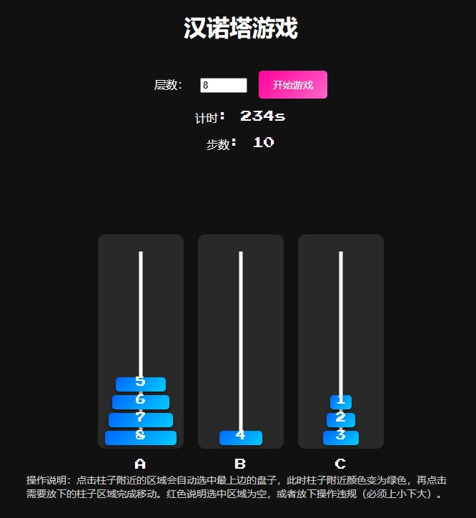

# 汉诺塔 - Tower of Hanoi

 

**汉诺塔** 是一款经典的益智游戏，通过移动盘子，将所有盘子从起始柱子移动到目标柱子。本项目使用现代前端技术实现，支持自定义盘子数量、动态效果和流畅的游戏体验。

🌐 **项目地址**: [https://github.com/yviscool/tower-of-hanoi](https://github.com/yviscool/tower-of-hanoi)

---

## 🎮 功能特点

- **自定义盘子数量**：支持 3 到 12 层的汉诺塔挑战。
- **动态效果**：盘子移动流畅，带有音效和动画。
- **计时与步数统计**：实时记录游戏时间和步数。
- **胜利提示**：游戏完成后显示烟花效果和胜利弹窗。
- **响应式设计**：适配桌面和移动设备，随时随地畅玩。

---

## 🚀 使用方法

### 在线体验
直接访问 [tower-of-hanoi](https://tower-of-hanoi-cyan.vercel.app/) 即可在线体验。

### 本地运行
1. 克隆项目到本地：
   ```bash
   git clone https://github.com/yviscool/tower-of-hanoi.git
   ```
2. 进入项目目录：
   ```bash
   cd tower-of-hanoi
   ```
3. 打开 `index.html` 文件即可运行。

---

## 🛠️ 技术栈

- **HTML5**：页面结构与内容。
- **CSS3**：样式与动画效果。
- **JavaScript**：游戏逻辑与交互。
- **SweetAlert2**：美化弹窗提示。
- **tsParticles**：实现烟花效果。

---

## 📸 截图



---

## 📜 许可证

本项目基于 **MIT 许可证** 开源。详情请参阅 [LICENSE](LICENSE) 文件。

---

## 🤝 贡献指南

欢迎贡献代码！如果您有任何建议或发现问题，请提交 Issue 或 Pull Request。

1. Fork 本项目。
2. 创建新分支 (`git checkout -b feature/YourFeature`)。
3. 提交更改 (`git commit -m 'Add some feature'`)。
4. 推送分支 (`git push origin feature/YourFeature`)。
5. 提交 Pull Request。

---

## 📧 联系

如有任何问题，请联系：  
📩 **Email**: [your-email@example.com](mailto:your-email@example.com)  
🌐 **GitHub**: [yviscool](https://github.com/yviscool)

---

**Enjoy the game! 🎉**

---
